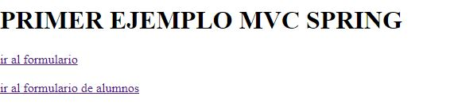

# Spring MVC Practica 
### 1) imgenes del web proyect, y configuracion xml Spring MVC para esacaneos en el paquete correspondiente y recursos estaticos de vista
###  tambien configuracion de archivo xml web de java ee para uso con springMVC 

___

 

___

## spring_mvc_servlet.xml

___

## web.xml

___
### 2)   cuando se ejecuta  el pryecto  ` MVCSpring ` inicia con el archivo jsp paginaEjemplo configurado con el Controlador

## controlador 

## codigo de  ` paginaEjemplo `  con jsp y html 

___
### 3) se pulsa ir al formulario alumnos y me envia a al `Alumnocontroller.java `  y me devuelve el `alumnoRegistroFormulario.jsp`

## codigo del jsp   alumnoRegistroFormulario.jsp

## formulacio en el navegador 

   ###  **si necesitas la ip escribe en el cmd de windows   ` ipconfig ` donde dice  Direccion IPv4  esa es la ip del servior**
   ###  **EJEMPLO**

       

___
### 4) confirmar ip 

 

___
### 5) si te pide permisos de red aceptalos es para poder conectar al servidor

___
### 6)  escoge ipcliente para chatear 

___
### 7)  el  ` ClienteChat.exe ` de otro pc responde 

___

###  8) sigue la conversa 

    
