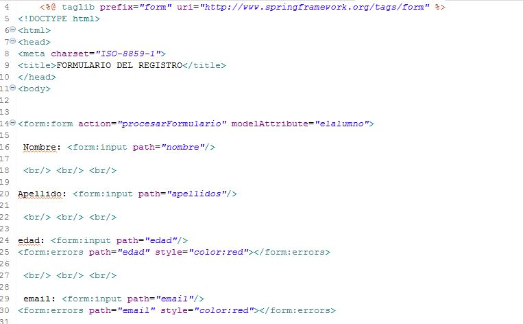

# Spring MVC Practica 
### 1) imgenes del web proyect, y configuracion xml Spring MVC para esacaneos en el paquete correspondiente y recursos estaticos de vista
###  tambien configuracion de archivo xml web de java ee para uso con springMVC 

___

 

___

## spring_mvc_servlet.xml

___

## web.xml

___
### 2)   cuando se ejecuta  el pryecto  ` MVCSpring ` inicia con el archivo jsp paginaEjemplo configurado con el Controlador

## controlador 

## codigo de  ` paginaEjemplo `  con jsp y html 

___
### 3) cuando pulsa ir al formulario alumnos del punto 2, me envia a al `Alumnocontroller.java `  y me devuelve el `alumnoRegistroFormulario.jsp`
## se procesa el modelo dandole un atributo al objeto alumno para poder ser utilizado en vista `elalumno` y procesar los datos registrados.

## codigo del jsp   alumnoRegistroFormulario.jsp con jsp tags. 

## procesa tambien los metodos get y set del Alumnos.java (imagen de abajo)  con el atributo path.de imgen de arriba   

## formulario en el navegador (ver imgen de abajo) 

___

### 4) una ves ingresados los datos son procesados en  `procesarFormulario` de Alumnocontroller.java ` ingresados en Objeto Alumno el cual nos devuelve 
### ` confirmacionRegistroAlumno.jsp`  si las validaciones atraves de Hibernate validetion se cumplen.

## una ves validado  me muestra la informacion  

___

   
